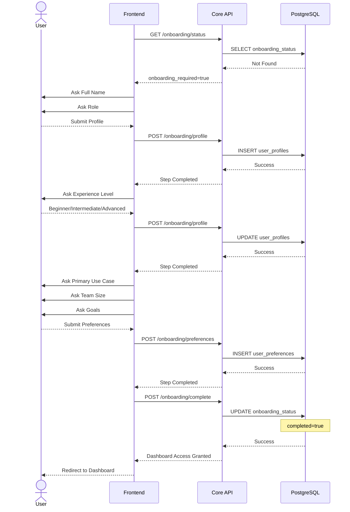

```mermaid
sequenceDiagram

    actor User
    participant FE as Frontend
    participant API as Core API
    participant DB as PostgreSQL

    %% LOGIN COMPLETE

    FE->>API: GET /onboarding/status
    API->>DB: SELECT onboarding_status
    DB-->>API: Not Found
    API-->>FE: onboarding_required=true

    %% STEP 1 PROFILE

    FE->>User: Ask Full Name
    FE->>User: Ask Role

    User-->>FE: Submit Profile

    FE->>API: POST /onboarding/profile

    API->>DB: INSERT user_profiles
    DB-->>API: Success

    API-->>FE: Step Completed

    %% STEP 2 EXPERIENCE

    FE->>User: Ask Experience Level

    User-->>FE: Beginner/Intermediate/Advanced

    FE->>API: POST /onboarding/profile

    API->>DB: UPDATE user_profiles
    DB-->>API: Success

    API-->>FE: Step Completed

    %% STEP 3 USE CASES

    FE->>User: Ask Primary Use Case
    FE->>User: Ask Team Size
    FE->>User: Ask Goals

    User-->>FE: Submit Preferences

    FE->>API: POST /onboarding/preferences

    API->>DB: INSERT user_preferences
    DB-->>API: Success

    API-->>FE: Step Completed

    %% COMPLETE

    FE->>API: POST /onboarding/complete

    API->>DB: UPDATE onboarding_status
    Note over DB: completed=true

    DB-->>API: Success

    API-->>FE: Dashboard Access Granted

    FE-->>User: Redirect to Dashboard
```