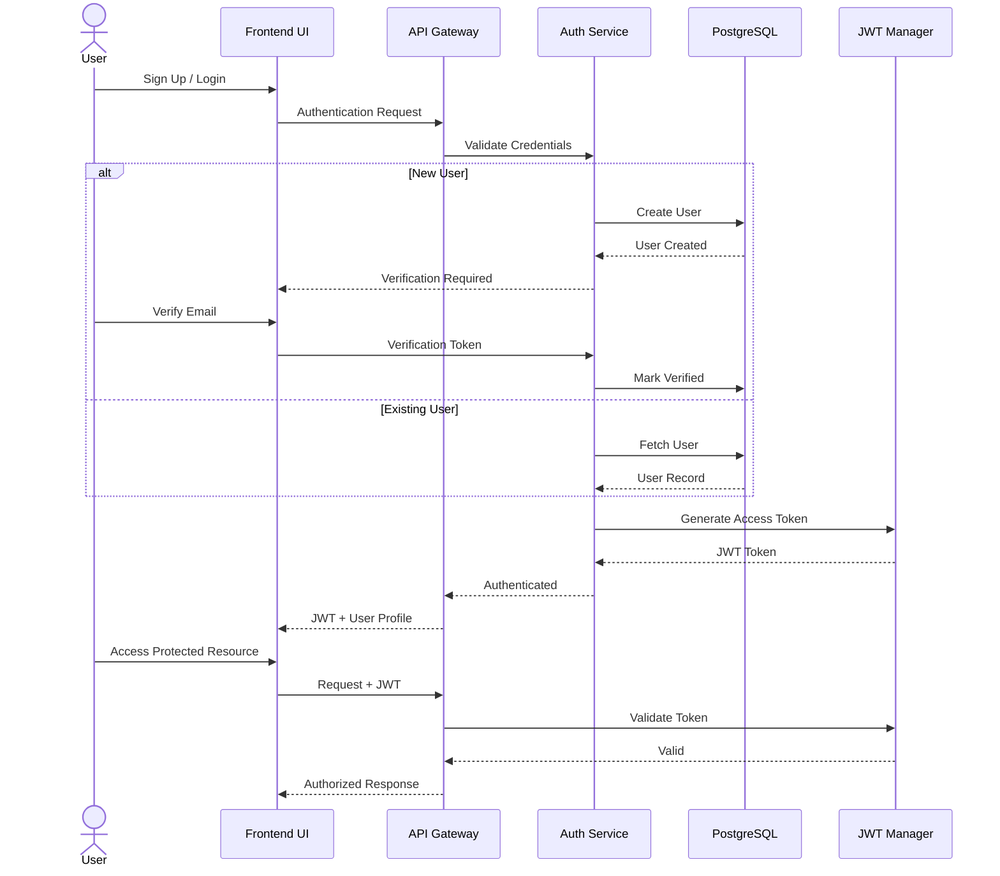
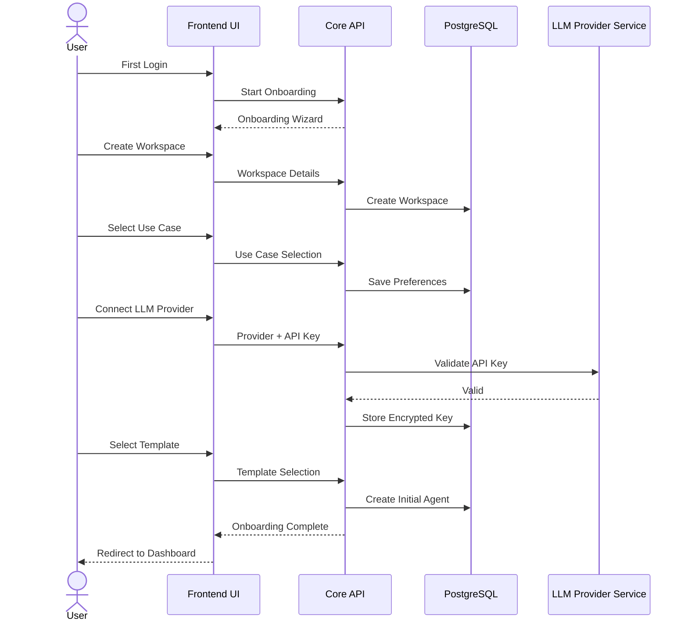
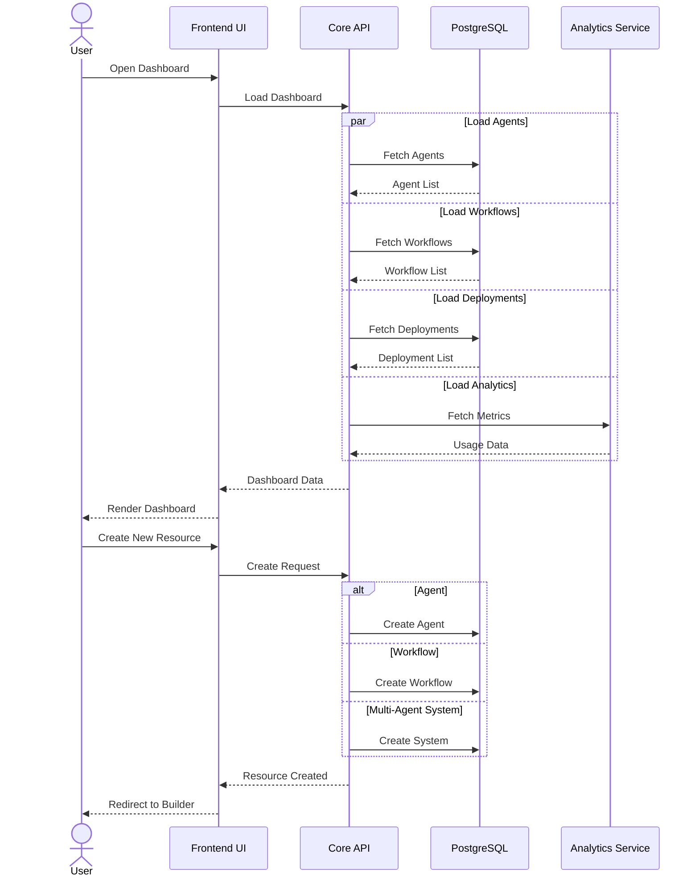
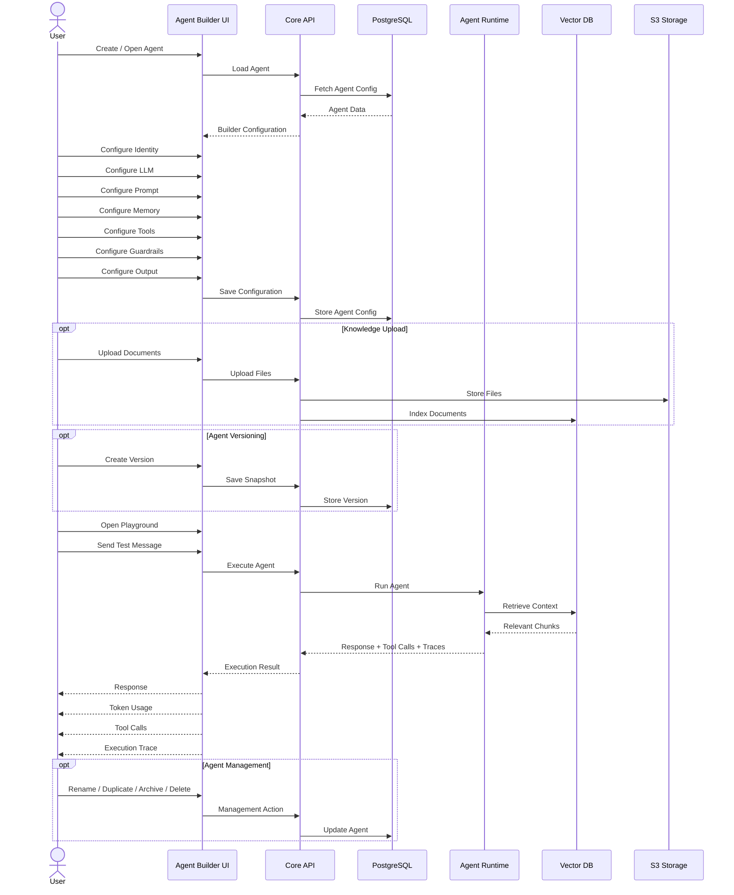
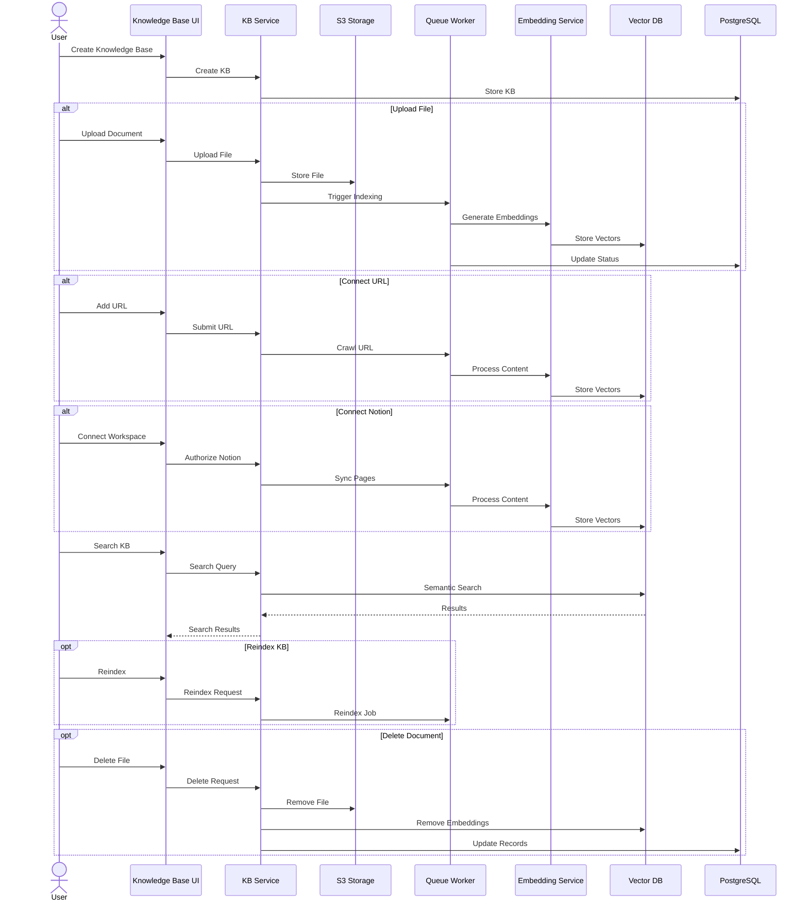
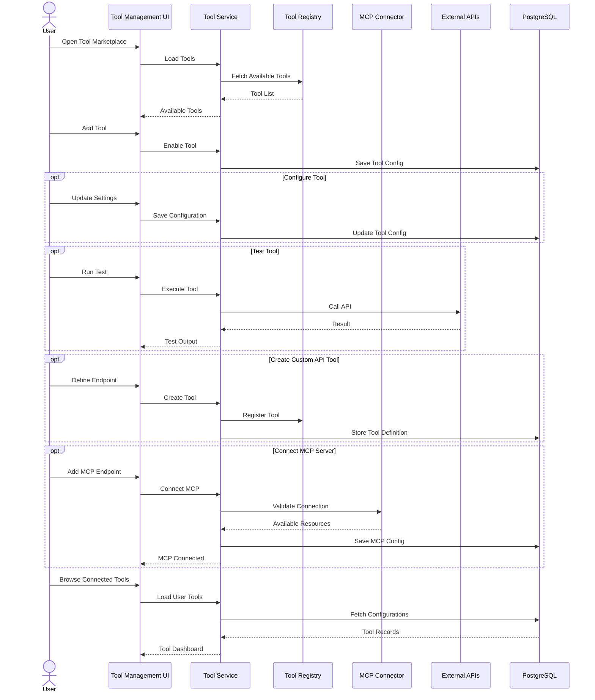
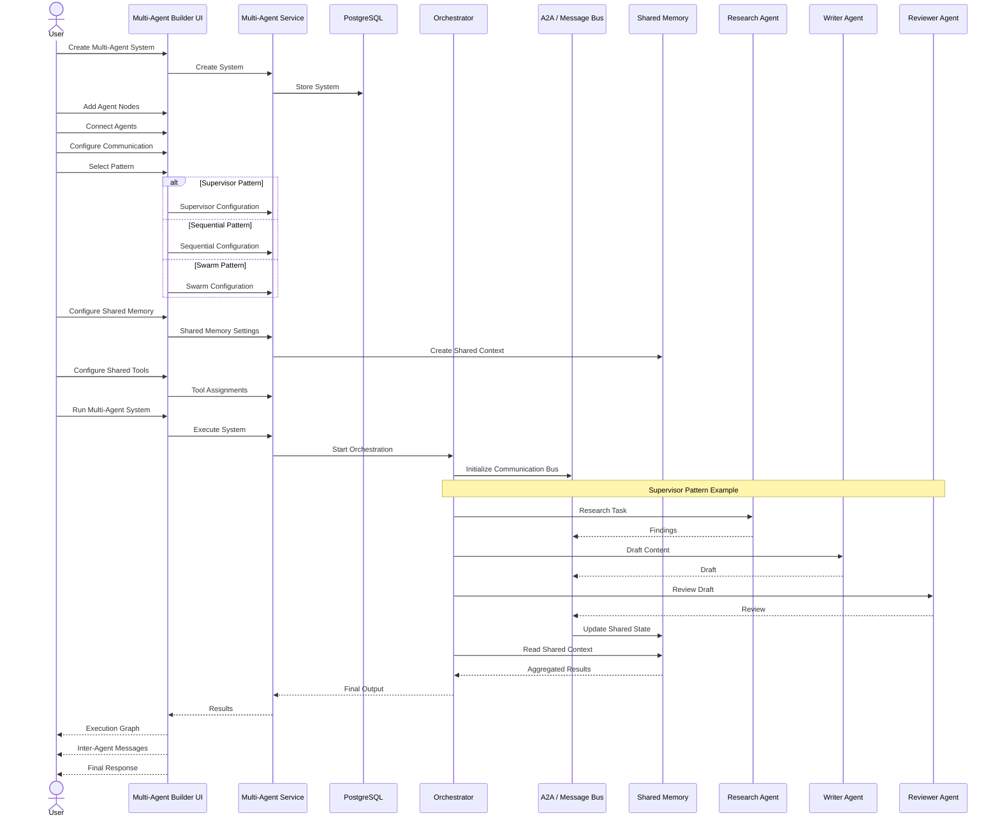
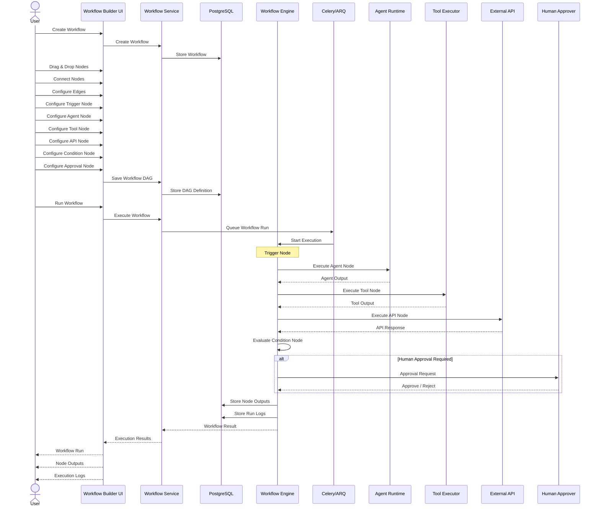
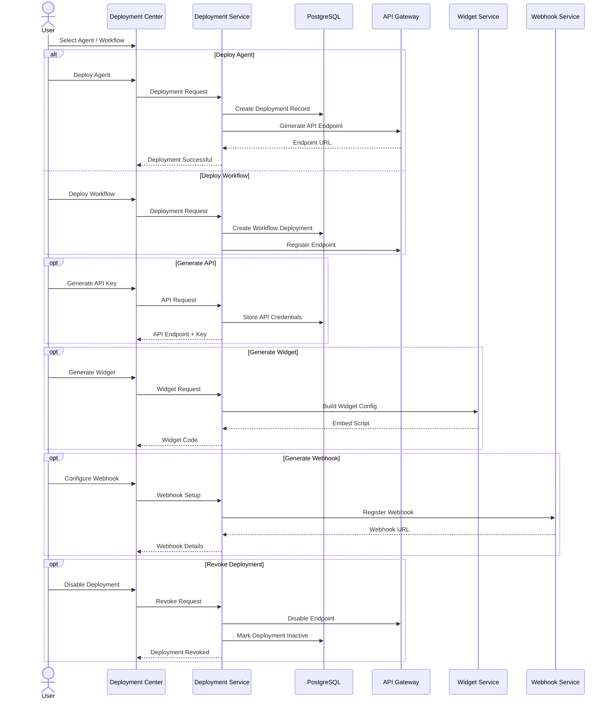
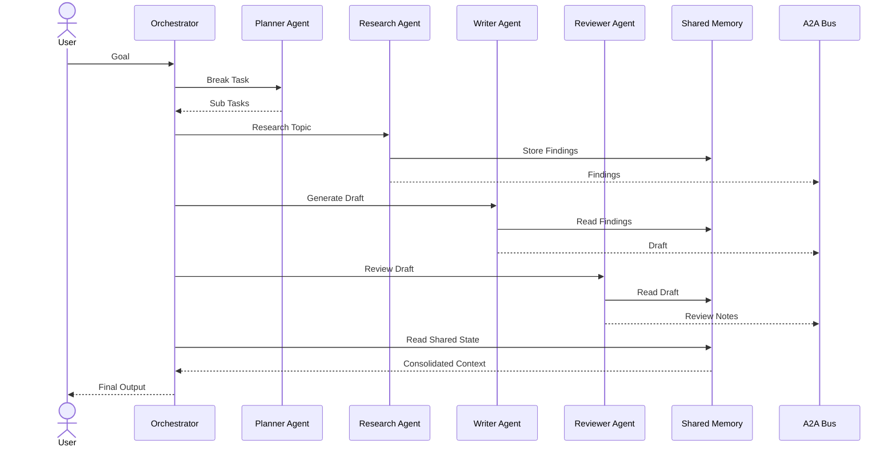

# 1. Authentication & Account Management



---

# 2. Onboarding Flow



---

# 3. Dashboard


# 4. Single Agent Builder



---

# 5. Knowledge Base Management



---

# 6. Tool Management


# 7. Multi-Agent Builder



---

# 8. Workflow Builder



---

# 9. Deployment Center



---

# Advanced Multi-Agent Runtime Flow (Actual Execution Architecture)



---

# Advanced Workflow Runtime Flow (Actual DAG Execution)

```mermaid
sequenceDiagram
    actor User
    participant Trigger as Trigger Node
    participant Engine as Workflow Engine
    participant Agent as Agent Node
    participant Tool as Tool Node
    participant API as API Node
    participant Cond as Condition Node
    participant Human as Approval Node
    participant Finish as End Node

    User->>Trigger: Start Workflow

    Trigger->>Engine: Trigger Payload

    Engine->>Agent: Execute Agent
    Agent-->>Engine: Response

    Engine->>Tool: Execute Tool
    Tool-->>Engine: Tool Result

    Engine->>API: Call External API
    API-->>Engine: API Response

    Engine->>Cond: Evaluate Logic

    alt Condition True
        Cond->>Human: Request Approval
        Human-->>Cond: Approved
    else Condition False
        Cond-->>Engine: Continue
    end

    Cond->>Finish: Final Payload
    Finish-->>User: Workflow Result
